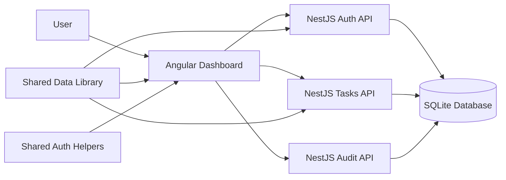

# SecureTaskFlow

SecureTaskFlow is a full-stack task management platform built to demonstrate production-style authorization, organization scoping, auditability, and a polished Angular workflow. It is designed as a portfolio project that goes beyond a basic todo app by showing how a real team dashboard can protect data and make user activity traceable.

## Highlights

- JWT authentication with seeded demo accounts for Owner, Admin, and Viewer roles.
- Role-based access control with shared permission helpers and NestJS guards.
- Organization-aware task visibility for parent and child organizations.
- Kanban-style Angular dashboard with create, edit, delete, drag-and-drop, search, filters, sorting, dark mode, and offline messaging.
- Audit log API and dashboard panel for Owner/Admin users.
- Nx monorepo with shared TypeScript contracts used across frontend and backend.
- Unit, API e2e, and dashboard e2e coverage targets plus GitHub Actions CI.

## Tech Stack

| Layer | Tools |
| --- | --- |
| Frontend | Angular 21, Angular CDK drag/drop, standalone components |
| Backend | NestJS 11, TypeORM, Passport JWT, bcrypt |
| Data | SQLite for local development, PostgreSQL-ready configuration notes |
| Monorepo | Nx 22, shared TypeScript libraries |
| Testing | Jest, Angular unit tests, Playwright |
| CI | GitHub Actions |

## Architecture



## Project Structure

```text
secure-task-flow/
├── api/              # NestJS REST API
├── dashboard/        # Angular frontend
├── data/             # Shared DTOs, enums, and contracts
├── auth/             # Shared RBAC helpers
├── api-e2e/          # API end-to-end tests
├── dashboard-e2e/    # Playwright browser tests
└── .github/          # CI workflow
```

## Demo Accounts

The API seeds these users when the database is empty:

| Role | Email | Password | Access |
| --- | --- | --- | --- |
| Owner | `owner@acme.com` | `password123` | Full task access, child organization visibility, audit log |
| Admin | `admin@acme.com` | `password123` | Full task access for own organization, audit log |
| Viewer | `viewer@acme.com` | `password123` | Read-only task access |

## Getting Started

### Prerequisites

- Node.js 20 or newer
- npm
- Git

### Install

```bash
npm install
```

### Run The API

```bash
npx nx serve api
```

The API runs at `http://localhost:3000/api`.

### Run The Dashboard

```bash
npx nx serve dashboard
```

Open `http://localhost:4200` and sign in with one of the demo accounts.

## Useful Commands

```bash
# Run API unit tests
npx nx test api

# Run dashboard unit tests
npx nx test dashboard

# Run shared library tests
npx nx test auth

# Run API e2e tests
npx nx e2e api-e2e

# Run dashboard e2e tests
npx nx e2e dashboard-e2e

# Build production apps
npx nx build api
npx nx build dashboard
```

## Core API

| Method | Endpoint | Description | Required Access |
| --- | --- | --- | --- |
| `POST` | `/api/auth/login` | Sign in and receive JWT | Public |
| `POST` | `/api/auth/register` | Register a user | Public in demo |
| `GET` | `/api/tasks` | List scoped tasks | Read |
| `POST` | `/api/tasks` | Create a task | Owner/Admin |
| `PUT` | `/api/tasks/:id` | Update a task | Owner/Admin |
| `DELETE` | `/api/tasks/:id` | Delete a task | Owner/Admin |
| `GET` | `/api/audit-log` | View scoped audit events | Owner/Admin |

## Security Model

SecureTaskFlow uses three authorization layers:

- `JwtAuthGuard` verifies the access token and loads the current user.
- `RolesGuard` checks high-level role access such as Owner/Admin-only routes.
- `PermissionsGuard` checks fine-grained permissions such as `create`, `update`, `delete`, and `view_audit`.
- `OrganizationGuard` keeps task access scoped to the user's organization hierarchy.

The frontend uses the shared `auth` library for role-aware UI decisions, while the backend remains the source of truth for enforcement.

## Portfolio Notes

This project is meant to show:

- Full-stack TypeScript with a clean monorepo structure.
- Practical RBAC instead of only visual role checks.
- Backend audit logging surfaced in the UI.
- A dashboard experience with real task workflows.
- Testable API and browser flows suitable for CI.

## Screenshots

Add screenshots or GIFs here before publishing the portfolio page:

- Login page with demo accounts.
- Dashboard board with task columns.
- Audit log panel as Owner/Admin.
- Viewer account showing read-only behavior.

## Roadmap

- Deploy the dashboard and API for a live demo.
- Add task due dates and priority.
- Add user management for Owner/Admin.
- Replace local SQLite with managed PostgreSQL in production.
- Add refresh tokens and rate limiting for production auth hardening.
